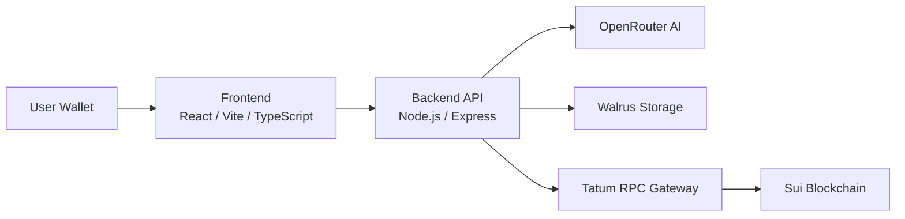
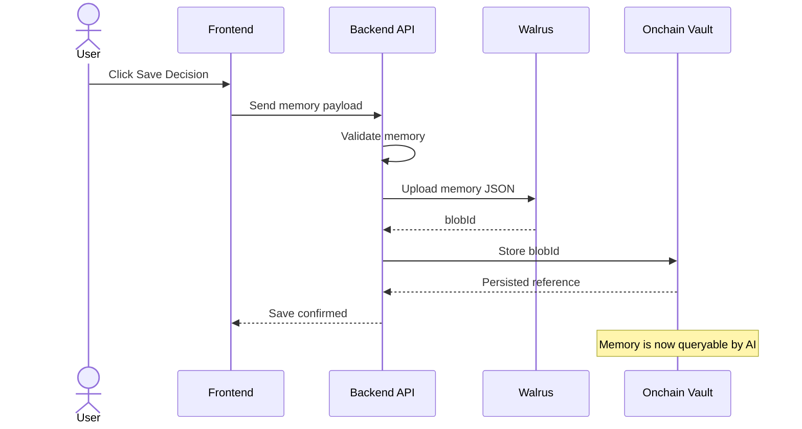
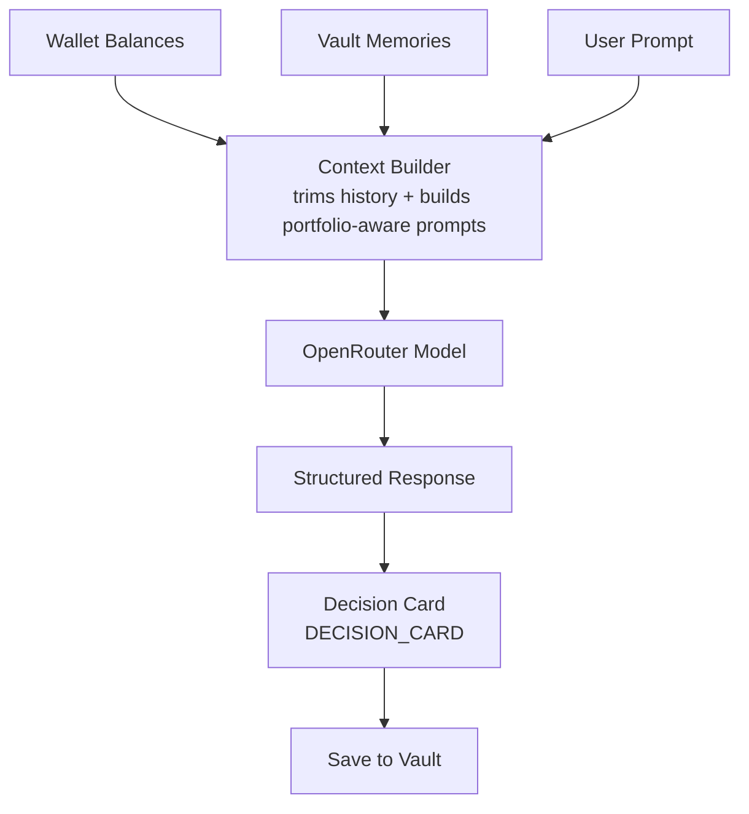
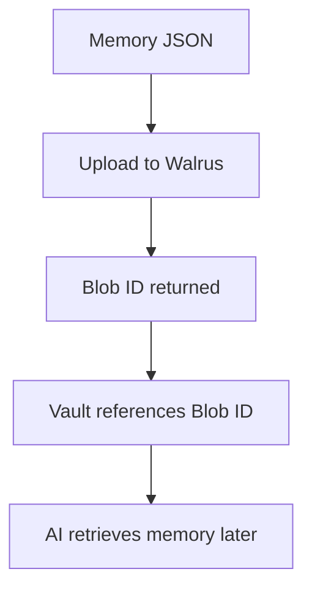

# MnemoSui

MnemoSui is an AI-powered onchain memory system for Sui. It turns wallet activity, research, and trading decisions into permanent memory stored on Walrus, then lets the AI recall that history in future chats.

## Why it matters

Crypto wallets are usually stateless. MnemoSui adds memory:
- persistent decisions
- wallet-aware chat
- portfolio-aware suggestions
- onchain journaling
- recall across sessions

## Walrus

Walrus provides durable decentralized storage for memories and decision records. MnemoSui saves structured memory objects there so the vault can load them later and the AI can reason from them.

## AI memory

The backend summarizes memory content, trims chat history to avoid context overflow, and falls back across multiple OpenRouter free models when one fails or returns empty output.

## Setup

```bash
npm install
npm run build
npm run dev:api
npm run dev:web
```

## Environment variables

Backend:
- `OPENROUTER_API_KEY`
- `TATUM_API_KEY`
- `TATUM_RPC_URL` or `TATUM_TESTNET_RPC_URL`
- `TATUM_MAINNET_RPC_URL`
- `WALRUS_PUBLISHER_URL`
- `WALRUS_AGGREGATOR_URL`
- `WALRUS_TESTNET_PUBLISHER_URL`
- `WALRUS_TESTNET_AGGREGATOR_URL`
- `WALRUS_MAINNET_PUBLISHER_URL`
- `WALRUS_MAINNET_AGGREGATOR_URL`

Frontend:
- `VITE_BACKEND_URL`

## Demo flow

1. Connect wallet
2. Open Chat
3. Ask for a portfolio suggestion
4. Receive a structured decision card
5. Save the decision
6. Open Vault and confirm the saved memory
7. Ask why that decision was made

## Mainnet deployment

- Frontend: Vercel
- Backend: Railway or Render
- Storage: Walrus
- Blockchain: Sui

## Tech stack

- React + Vite
- Express + TypeScript
- OpenRouter
- Walrus
- Sui / Tatum
- TanStack Query

---

## System Architecture



The frontend handles wallet connection and UI through Sui wallet adapters. The backend orchestrates AI and blockchain logic, Walrus stores permanent memory objects, Tatum provides indexed blockchain access, and AI reasons over wallet memory context before returning a response.

---

## Memory Save Flow



The vault stores only the blob reference, so the raw memory stays durable in Walrus and can be reloaded into future AI context.

---

## AI Reasoning Pipeline



- Conversation history is trimmed to keep the context window focused and reliable.
- Portfolio-aware prompts merge balances, vault memories, and the current request.
- The model returns a structured `DECISION_CARD` payload for deterministic UI rendering.
- Approved AI-generated actions are saved permanently to the vault.

---

## Walrus Storage Design

Walrus was chosen because it gives MnemoSui decentralized permanence with content-addressed blobs. The app stores full memory JSON off-chain as immutable objects, then keeps only the blob reference onchain for later retrieval.



- Decentralized permanence without a single mutable database.
- Blob-based memory architecture with verifiable references.
- Immutable AI decision history that can be replayed later.

---

## Multi-Network Support

MnemoSui supports both Sui Testnet and Sui Mainnet. Network switching happens at runtime, and each environment is isolated with its own vault state, Walrus environment, and RPC endpoint so testnet and mainnet memories never mix.

| Network | Purpose     | Storage        | RPC           |
| ------- | ----------- | -------------- | ------------- |
| Testnet | Development | Walrus Testnet | Tatum Testnet |
| Mainnet | Production  | Walrus Mainnet | Tatum Mainnet |

---

## Security & Privacy

- Non-custodial wallet architecture.
- No private keys are stored or transmitted.
- The AI only receives user-approved memory context.
- Walrus storage is decentralized.
- Frontend code never exposes API secrets.

---

## Future Roadmap

- AI portfolio scoring
- Wallet risk analysis
- Autonomous memory tagging
- Cross-chain memory support
- AI trade journaling
- DAO memory coordination
- Mobile app
- AI-generated portfolio summaries
